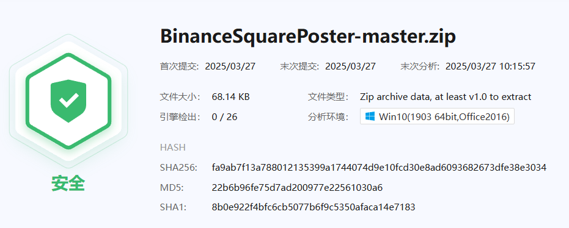

# Twitter to Binance Square Sync

## 🚀 项目简介
本项目是一个自动同步 Twitter 推文到 Binance Square 的开源工具，基于 **FastAPI**、**Celery**、**Redis**、**Puppeteer** 和 **PostgreSQL** 运行，并支持 **AMD SEV (Secure Encrypted Virtualization)** 以增强用户数据安全。

## 🎯 功能特点
✅ **自动同步 Twitter 推文到 Binance Square**

✅ **支持 Redis 任务队列，提升并发性能**

✅ **支持 Puppeteer 进行 Binance Square 自动发帖**

✅ **采用 PostgreSQL 作为数据库，提高查询速度**

✅ **错误恢复机制：支持失败自动重试 & 任务队列管理**

✅ **AMD SEV 安全运行，保障用户 Twitter & Binance 账户信息**

✅ **提供 API 接口，前端可视化管理同步 & 错误日志**

✅ **使用微步沙箱进行代码安全检查**



---

## 📌 快速开始
### **1️⃣ 运行后端**
```bash
cd backend
pip install -r requirements.txt
uvicorn main:app --host 0.0.0.0 --port 8000
```

### **2️⃣ 运行前端**
```bash
cd frontend
npm install
npm run dev
```

### **3️⃣ 启动 Redis + Celery**
```bash
docker-compose up -d redis
celery -A backend.tasks worker --loglevel=info
```

### **4️⃣ 测试 Binance 发帖**
```bash
cd automation
node binance_puppeteer.js "test_user" "Hello Binance!"
```

---

## 📦 Docker 部署
1️⃣ **启动全部服务**
```bash
docker-compose up -d --build
```
2️⃣ **查看日志**
```bash
docker-compose logs -f
```

---

## 🔒 AMD SEV 安全运行
1️⃣ **配置 SEV**
```bash
echo "[sev] enabled = true" > deployment/sec_config.toml
```
2️⃣ **运行 SEV 容器**
```bash
docker-compose up -d --build
```

---

## 📜 许可证
本项目基于 **Commercial License**，欢迎贡献代码！🎯

---

## 🤝 贡献指南
欢迎提交 **Issue & PR**！

🚀 **Enjoy & contribute!** 🎉

